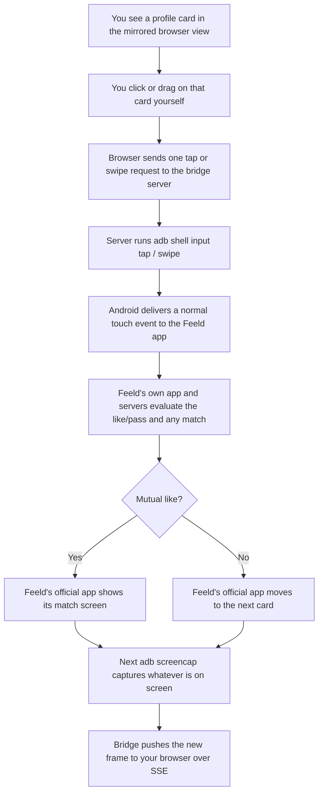

# FEELD Browser Bridge


A small local web interface that mirrors your connected Android device's screen in a desktop browser and forwards manual taps, swipes, long-presses, text, and hardware-button events through Android Debug Bridge (ADB).

It was built around the **official Feeld Android app**, but it operates at the OS input/display level rather than inside any single app, so it mirrors and controls whatever is in the foreground on the device. Feeld is only special-cased in one place: the **Open Feeld** button, which launches a configurable package name (`FEELD_PACKAGE`).

It does **not** call Feeld's private API, scrape profiles, automate likes/messages, bypass authentication, or store screenshots. Every action on the phone is the direct result of a single explicit click in the browser; there is no bot loop, no scheduler, and no batching of actions.

## Contents

- [How it works](#how-it-works)
- [Event listeners](#event-listeners)
- [How a match happens through this bridge](#how-a-match-happens-through-this-bridge)
- [Requirements](#requirements)
- [Setup](#setup)
- [Run](#run)
- [Controls](#controls)
- [Multiple Android devices](#multiple-android-devices)
- [Configuration](#configuration)
- [API reference](#api-reference)
- [Troubleshooting](#troubleshooting)
- [Limitations](#limitations)
- [Security notes](#security-notes)
- [Use via SSH](#use-via-ssh)
  - [Sending a chat message (Type) over the SSH tunnel](#sending-a-chat-message-type-over-the-ssh-tunnel)
- [Privacy and appropriate use](#privacy-and-appropriate-use)
- [Development](#development)

## How it works

```
 Browser (public/index.html)                  Node server (server.js)                Android device
┌──────────────────────────┐   EventSource   ┌───────────────────────┐   adb    ┌──────────────────┐
│          │ <────────────── │ /api/events (SSE)     │ ───────> │ screencap -p      │
│  tap / swipe / long-press│ ── fetch POST ─>│ /api/tap, /api/swipe, │ ───────> │ input tap/swipe/  │
│  hardware buttons        │                 │ /api/key, /api/type   │          │ keyevent/text     │
└──────────────────────────┘                 └───────────────────────┘          └──────────────────┘
```

- A background loop (`setInterval(captureFrame, FRAME_INTERVAL_MS)`, `.unref()`'d so it never keeps the process alive on its own) calls `adb exec-out screencap -p` via `execFile` (never a shell string — see [Security notes](#security-notes)) to fetch a raw PNG screenshot. A `capturing` boolean guards against overlapping ticks: if a capture is still in flight when the timer fires again, that tick is skipped rather than queued, so a slow device self-throttles instead of piling up ADB processes.
- The PNG is decoded and re-encoded with `sharp` — `metadata()` first to read the device's native resolution, then `resize({ width: 900, withoutEnlargement: true })` followed by `.jpeg({ quality: 76, mozjpeg: true })`. Only the resulting JPEG `Buffer` is kept, in the module-level `latestFrame` variable; the previous buffer becomes eligible for GC on the next successful capture. Nothing touches disk.
- The device connection (`adb devices`) is only re-verified periodically (`DEVICE_RECHECK_MS = 3000`) or immediately after an error, not on every single frame capture, to keep ADB overhead low. While `lastError` is set, capture ticks between recheck windows return early without spawning `adb` at all.
- `adb` calls run through two thin wrappers: `adbText` (`encoding: "utf8"`, 8s timeout, 4MB `maxBuffer`) for command output like `adb devices`, and `adbBuffer` (`encoding: "buffer"`, 10s timeout, 32MB `maxBuffer`) for the screenshot itself. Both use `execFileAsync`, the `promisify`'d form of `child_process.execFile`, so `adb` runs as a genuine child process — it never blocks Node's event loop, and argument arrays are passed straight to `execve`-style spawning rather than being interpolated into a shell string.
- Every pointer/keyboard/tap/swipe/type request that reaches the server is funneled through a single in-process promise chain (`queueInput`), so rapid clicks execute as sequential `adb shell input ...` calls in the order they were received, rather than as overlapping child processes that could race or land on the device out of order.
- The browser holds a persistent `EventSource` connection to `/api/events`. The server pushes a status payload (`Content-Type: text/event-stream`, `Cache-Control: no-store`) over Server-Sent Events every time a new frame is captured or an error occurs, instead of the browser polling blindly. The browser only re-fetches `/api/frame.jpg` when the pushed `frameVersion` actually changes; the endpoint itself is also served with cache-busting headers (`no-store, no-cache, must-revalidate`) so an intermediate cache can't serve a stale frame.
- Every pointer/keyboard action in the browser becomes exactly one `adb shell input ...` call. Coordinates are translated from on-screen pixels back to the device's real resolution (`sourceWidth`/`sourceHeight`, captured from the PNG metadata) before being sent, and are clamped server-side to `[0, sourceWidth - 1]` / `[0, sourceHeight - 1]` regardless of what the browser computes.

## Event listeners

### Server (`server.js`)

| Listener | Registered on | Purpose |
| --- | --- | --- |
| `"error"` | `server` (the `http.Server` returned by `app.listen`) | Prints a friendly message and exits if `PORT` is already in use (`EADDRINUSE`); rethrows anything else. |
| `"close"` | each SSE request in `/api/events` | Removes that client from the broadcast set once the browser tab closes or navigates away. |
| `"error"` | each SSE response in `/api/events` | Removes that client from the broadcast set if a write hits an already-broken pipe (e.g. the OS tore down the socket before the request's `"close"` event fired). Without this listener, that write failure would surface as an `uncaughtException` and take the whole server down over a single dead browser tab. `broadcastStatus()` also wraps each `client.write()` in a `try/catch` as a second line of defense. |
| `"SIGINT"` / `"SIGTERM"` | `process` | Stops the capture timer, closes all open SSE connections, and closes the HTTP server before exiting. |
| `"uncaughtException"` | `process` | Logs the error and shuts down instead of leaving a raw stack trace and a hung process. |
| `"unhandledRejection"` | `process` | Same safety net as above, for a promise rejection nothing awaited or caught. |

### Browser (`public/index.html`)

| Listener | Element | Purpose |
| --- | --- | --- |
| `"pointerdown"` | `#screen` | Starts tracking a tap/swipe/long-press gesture and arms the long-press timer. |
| `"pointermove"` | `#screen` | Updates the drag indicator; cancels the long-press timer once the pointer moves past the threshold. |
| `"pointerup"` | `#screen` | Resolves the gesture into a tap or swipe (or does nothing if a long-press already fired). |
| `"pointercancel"` | `#screen` | Clears in-progress gesture state if the OS cancels the pointer. |
| `"click"` | hardware buttons (`[data-key]`, `#open`, `#wake`, `#sendText`) | Sends the corresponding `/api/...` request. |
| `"keydown"` | `#text` input | Submits typed text when Enter is pressed. |
| `"message"` / `"error"` | `EventSource` (`/api/events`) | Applies pushed status/frame updates; shows "Reconnecting…" if the stream drops (it reconnects automatically). |

## How a match happens through this bridge

Matching logic never runs in this codebase. The bridge only relays the single touch you made and shows back whatever the official app renders; Feeld's app and servers make every decision about likes, passes, and matches, exactly as they would if you were holding the phone.


Above is an example of how this would work, below is a flow chart on how matches work:



Nothing here queues actions, reads Feeld's private API, or infers who to swipe on; each step only exists because you performed exactly one manual gesture.

## Requirements

- Node.js 20 or newer
- Android Platform Tools (`adb`)
- An Android phone with USB debugging enabled, or an Android Studio emulator
- Feeld installed and logged in on that device, if you intend to use the **Open Feeld** shortcut (the screen mirroring and tap/swipe/key controls work with whatever app is in the foreground, not just Feeld)

## Setup

### macOS

```bash
brew install node android-platform-tools
```

### Linux

```bash
sudo apt install android-tools-adb   # Debian/Ubuntu
# or your distro's equivalent package for `adb`
```

### Windows

Install Node.js, then install [Android Platform Tools](https://developer.android.com/tools/releases/platform-tools) and add the extracted folder to your `PATH` so `adb` is available in a terminal.

### Physical device (any OS)

1. Enable **Developer options** on the phone (tap the Build number 7 times in Settings → About phone).
2. Enable **USB debugging** inside Developer options.
3. Connect the phone by USB.
4. Accept the RSA-key authorization prompt that appears on the phone.

Confirm the connection:

```bash
adb devices
```

The device should appear with the status `device`, not `unauthorized` or `offline`.

## Run

```bash
npm install
npm start
```

Open:

```text
http://127.0.0.1:4173
```

Click **Open Feeld**. Click the mirrored screen to tap, click-and-drag to swipe, or press and hold to send a long-press (useful for context menus and drag-to-select).

## Controls

| Action | How | Sent to device |
| --- | --- | --- |
| Tap | Click on the screen | `input tap x y` |
| Swipe | Click, drag, release | `input swipe x1 y1 x2 y2 duration` |
| Long-press | Press and hold ~450ms without moving | `input swipe x y x y 550` (same start/end point) |
| Type | Focus a field on the phone, type in the sidebar box, click **Type** or press Enter | `input text ...` |
| Back / Home / Recent apps | Buttons | `input keyevent KEYCODE_BACK` / `HOME` / `APP_SWITCH` |
| Enter / Backspace | Buttons | `KEYCODE_ENTER` / `KEYCODE_DEL` |
| Lock screen / Wake screen | Buttons | `KEYCODE_POWER` / `KEYCODE_WAKEUP` |
| Volume up / down | Buttons | `KEYCODE_VOLUME_UP` / `KEYCODE_VOLUME_DOWN` |
| Open Feeld | Button | `monkey -p <package> -c android.intent.category.LAUNCHER 1` |

Typed text is limited to 500 characters of basic ASCII per request. `input text` on Android does not reliably support emoji or many non-ASCII characters, so use the phone's on-screen keyboard for those.

## Multiple Android devices

When more than one device or emulator is connected, choose one explicitly:

```bash
adb devices
ADB_SERIAL=emulator-5554 npm start
```

Starting the server without `ADB_SERIAL` while multiple devices are attached will fail fast with an explicit error rather than guessing which device to control.

Internally, `assertDevice()` runs `adb devices`, parses stdout by splitting on newlines, discarding the header row, and keeping only lines ending in the literal suffix `\tdevice` (`adb`'s tab-separated status column — this excludes `unauthorized` and `offline` states, not just missing ones). With `ADB_SERIAL` set, it looks for a line starting with `${ADB_SERIAL}\t`; without it, it requires the filtered list to contain exactly one entry. Every subsequent `adb` invocation is prefixed with `-s <serial>` (via `adbArgs()`) whenever `ADB_SERIAL` is set, so the target device is pinned for the lifetime of the process rather than re-resolved per call.

## Configuration

All configuration is via environment variables; there is no config file.

| Variable | Default | Purpose |
| --- | --- | --- |
| `HOST` | `127.0.0.1` | Interface to bind. Keep this local; see [Security notes](#security-notes). |
| `PORT` | `4173` | Port to listen on. |
| `ADB_SERIAL` | *(none)* | Target a specific device/emulator when more than one is connected. |
| `FRAME_INTERVAL_MS` | `450` | Screencap polling interval in milliseconds. Clamped to a minimum of `250`. Lower values increase responsiveness at the cost of more ADB/CPU load. |
| `FEELD_PACKAGE` | `co.feeld` | Android package name launched by the **Open Feeld** button. |

Example:

```bash
PORT=4173 \
HOST=127.0.0.1 \
ADB_SERIAL=emulator-5554 \
FRAME_INTERVAL_MS=450 \
FEELD_PACKAGE=co.feeld \
npm start
```

## API reference

The server only exposes these local endpoints; there is no external network call anywhere in the code.

| Method & path | Body | Description |
| --- | --- | --- |
| `GET /api/status` | *(none)* | One-shot JSON snapshot: `ok`, `serial`, `package`, `sourceWidth`, `sourceHeight`, `frameVersion`, `lastFrameAt`, `error`. |
| `GET /api/events` | *(none)* | Server-Sent Events stream. Pushes the same payload as `/api/status` whenever it changes. |
| `GET /api/frame.jpg?v=` | *(none)* | Latest captured JPEG frame. `v` is a cache-busting frame version, not authentication. |
| `POST /api/tap` | `{ x, y }` | Tap at device-resolution coordinates (clamped to the screen bounds). |
| `POST /api/swipe` | `{ x1, y1, x2, y2, duration? }` | Swipe between two points. `duration` is clamped to 80-1500ms (default 280ms). |
| `POST /api/key` | `{ key }` | One of `BACK`, `HOME`, `APP_SWITCH`, `ENTER`, `DEL`, `TAB`, `POWER`, `VOLUME_UP`, `VOLUME_DOWN`. |
| `POST /api/type` | `{ text }` | Basic ASCII text, 500 characters max, sent to the currently focused field. |
| `POST /api/open-feeld` | *(none)* | Launches `FEELD_PACKAGE` via `monkey`. |
| `POST /api/wake` | *(none)* | Sends `KEYCODE_WAKEUP`. |

All endpoints return `{ error: string }` with a non-2xx status on failure (e.g. no device connected, invalid coordinates). Status codes in practice: `400` for request validation failures (`/api/tap`, `/api/swipe`, `/api/key`, `/api/type`), `500` for ADB/device failures on endpoints that don't validate a body (`/api/open-feeld`, `/api/wake`), and `503` from `/api/frame.jpg` / an unhealthy `/api/status` when no frame has been captured yet. A final catch-all Express error-handling middleware (4-arg signature, registered after every route) converts anything that isn't already a JSON response — a malformed JSON body, a body over the 16KB limit, or any error a route forwards via `next(err)` — into the same `{ error }` shape instead of Express's default HTML error page, which would otherwise leak a Node stack trace and local file paths to the browser.

## Troubleshooting

- **"No authorized Android device or emulator is connected."** Run `adb devices`. If nothing is listed, check the USB cable/connection. If it says `unauthorized`, unlock the phone and accept the debugging prompt.
- **"More than one Android device is connected."** Set `ADB_SERIAL` to the one you want (see [Multiple Android devices](#multiple-android-devices)).
- **Screen appears black or frozen.** Some apps mark their window `FLAG_SECURE`, which blocks `screencap` from capturing it; this bridge cannot override that. Confirm the phone screen isn't simply locked or asleep, or try **Wake screen**.
- **`command not found: adb`.** ADB isn't on your `PATH`. Reinstall Android Platform Tools or add its folder to `PATH`.
- **Port already in use.** Another process is bound to `4173`; set `PORT` to a different value.
- **Typed text looks garbled or fails.** `input text` only supports basic ASCII; punctuation like quotes or backticks is escaped automatically, but emoji and most non-Latin scripts are not supported. Use the phone's own keyboard for those.
- **Status badge stuck on "Reconnecting…".** The `EventSource` connection dropped (e.g. the server restarted). It reconnects automatically; refresh the page if it doesn't recover within a few seconds.

## Limitations

- The screen refresh rate is intentionally modest; this is a lightweight remote, not video streaming.
- ADB text entry supports basic ASCII most reliably. Use the Android on-screen keyboard for emoji or unusual characters.
- Some Android apps can mark windows as secure. If Feeld ever enables that protection, screenshots may appear black and this bridge cannot override it.
- Purchases, account verification, location permission, camera access, and biometrics still happen inside the official Android app.
- App updates can change the Android package name or behavior.

## Security notes

- **Keep `HOST=127.0.0.1`.** Binding to `0.0.0.0` (or any non-loopback interface) would expose your live phone screen and full tap/swipe/type control to anything else on the same network, with no authentication in front of it. The server checks `HOST` against a small allowlist (`127.0.0.1`, `localhost`, `::1`, `[::1]`) at startup and prints a `console.warn` banner to stderr if it isn't one of those — a reminder, not a hard block, since it can't validate every possible loopback-equivalent value a given OS/network stack might accept.
- There is no login, token, or CSRF protection by design. This is meant to be a single-user, single-machine tool; see [Use via SSH](#use-via-ssh) if you need to reach it from another device.
- The server only shells out to a fixed `adb` binary with argument arrays (`execFile`, never a shell string), so request bodies cannot inject arbitrary shell commands. Even so, treat the local port as equivalent to physical access to the unlocked phone.
- Frames are kept in memory only (`latestFrame` buffer) and are overwritten every capture cycle; nothing is persisted to disk by this server.

## Use via SSH

The server only binds to `127.0.0.1` and has no authentication, so the supported way to use it from a machine other than the one running `adb` is an SSH tunnel, not opening the port on the network.


<br>On the machine with the Android device attached:</br>

```bash
npm start
```

From the other machine, forward a local port to the server's loopback port over SSH:

```bash
ssh -L 4173:127.0.0.1:4173 user@host-running-the-server
```

Then open `http://127.0.0.1:4173` in a browser on the machine you ran `ssh` from. Traffic (including the mirrored screen and every tap/swipe/keystroke) is encrypted inside the SSH tunnel; nothing is exposed on the network beyond standard SSH access to that host.

Notes:

- You need SSH access to the host running the server; this doesn't add any new authentication to the bridge itself, it reuses your existing SSH login.
- Close the tunnel (`Ctrl+C` on the `ssh` command, or kill the session) when you're done; the forwarded port stops working immediately.
- If you also want to reach it from a phone or tablet on the same Wi-Fi without SSH, use your SSH client's port-forwarding feature (e.g. Termius) rather than setting `HOST=0.0.0.0` on the server.

### Sending a chat message (`Type`) over the SSH tunnel

Typing into a Feeld chat is not a special case — it's the same `POST /api/type` request described in [Controls](#controls) and [API reference](#api-reference), so it inherits everything the tunnel already provides:

1. You focus a text field on the mirrored phone screen (a normal tap forwarded through `/api/tap`), then type into the sidebar `#text` input and press Enter or click **Type**.
2. The browser sends `POST /api/type` with `{ text }` as its body to `http://127.0.0.1:4173` — i.e. to the *local* end of the SSH tunnel on your machine, not to the remote host directly. OpenSSH forwards that TCP connection through the encrypted channel to `127.0.0.1:4173` on the machine actually running `server.js`, which is the only place the request is ever visible in the clear.
3. The server validates and ASCII-encodes the text (see `encodeAndroidInputText` in [How it works](#how-it-works)) and pushes it onto the same `queueInput` promise chain used by every other input action. That matters over SSH specifically: network latency or jitter on the tunnel can reorder when requests *arrive*, but `queueInput` still executes the resulting `adb shell input text ...` calls strictly in server-receipt order, so a message typed just after a tap can't race ahead of it and land on the wrong screen.
4. `adb shell input text ...` types the string into whatever field is currently focused on the device — the server has no concept of "the chat with X"; it relies entirely on you having tapped the right field first, exactly as with a direct (non-SSH) connection.
5. The resulting screen change (the message appearing in the compose box, or the chat scrolling after you tap send) reaches you the same way every other frame does: the next `adb exec-out screencap -p` capture is pushed over the `/api/events` SSE stream and pulled via `/api/frame.jpg`, all inside the same tunnel.

Because everything — the tap that focuses the field, the typed text, and the frame confirming it landed — travels over one `ssh -L` forwarded port, there is no separate "messaging channel" to secure or leak: SSH's transport encryption covers the request body (the message text itself) exactly as it covers taps and swipes. The existing limitations still apply unchanged over SSH: 500 characters, basic ASCII only (see [Controls](#controls)), and no batching — each `Type` click is one request, one `adb` call, one message.

## Privacy and appropriate use

Use this only for your own account and personal device. Do not add profile collection, bulk actions, automatic swiping, message automation, or API reverse engineering. The server is local-only by default and keeps only the latest compressed frame in memory.

## Development

```bash
npm install
npm run check   # node --check server.js (syntax validation only, no test suite)
npm start
```

There is no build step or bundler. `server.js` is plain ESM (`"type": "module"` in `package.json`) run directly by Node, and `public/index.html` is a single static file with inline CSS/JS served as-is.

Runtime dependencies are deliberately minimal: [`express@^5`](https://expressjs.com/) for routing/static serving/JSON body parsing, and [`sharp@^0.34`](https://sharp.pixelplumbing.com/) (a native binding over `libvips`) for PNG→JPEG transcoding and resizing. Express 5 forwards rejected promises from `async` route handlers to error-handling middleware automatically, but every handler here still uses an explicit `try/catch` so the intended status code (`400` vs `500`) is never ambiguous. There is no test suite; `npm run check` only runs `node --check server.js`, a parse-only syntax check, not a semantic one.

## Author 
Michael  Mendy (c) 2026.
